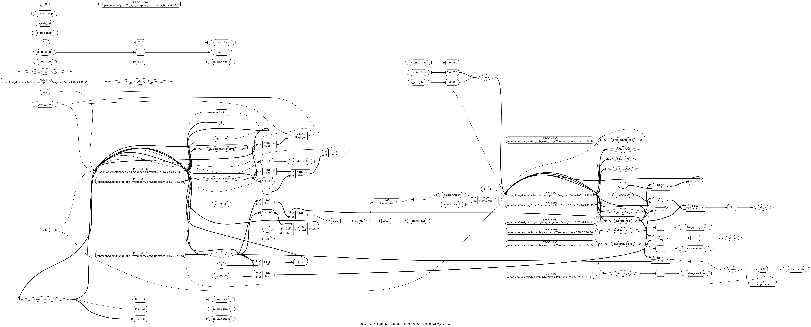
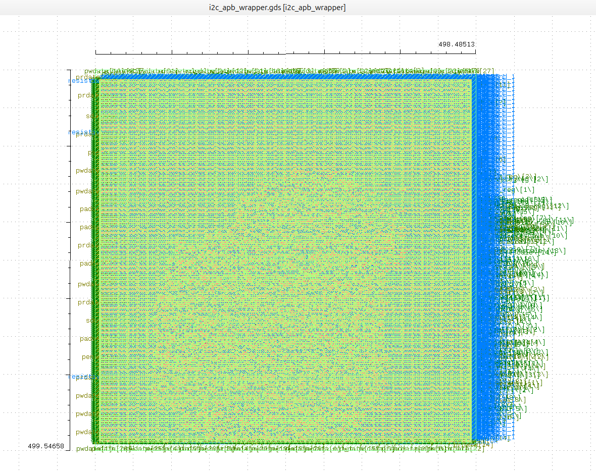
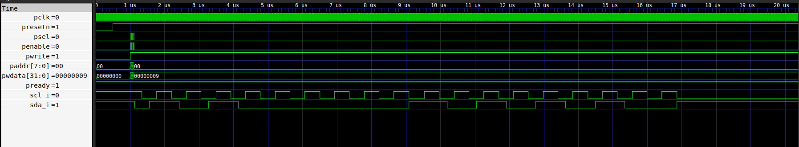
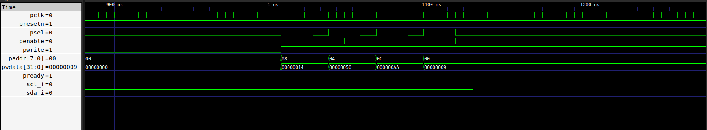

# I2C-APB Controller: Full Digital Design Flow (Sky130 ASIC)

## Project Overview
This repository contains the complete design and implementation of an **I2C Master Controller** with an **APB (Advanced Peripheral Bus) Wrapper**. The project follows a professional ASIC design flow:
- **ASIC Implementation:** Hardened using the **OpenLane** flow on the **SkyWater 130nm** Open Source PDK.

## Architecture
The system integrates an I2C Master Core, a 64-byte AXI-Stream compatible FIFO, and an APB Slave interface for seamless SoC integration.

*Figure 1: RTL Block Diagram & Interconnect*

## ASIC Sign-off Results (SkyWater 130nm)
The design successfully passed all physical verification and timing sign-off stages:
- [cite_start]**Die Area:** $36,755.25 \mu m^2$ [cite: 10]
- **Gate Count:** **3,367** logic gates (Total **25,623** cells including physical cells like fillers and decaps)
- [cite_start]**Sequential Elements:** **728** Flip-Flops (including the 64-byte FIFO buffer) [cite: 6-7]
- [cite_start]**Power Consumption:** **10.2 mW** (@ 100MHz, Typical Corner) [cite: 13]
- [cite_start]**Timing:** Setup Slack **MET** ($+4.63 ns$), Hold Slack **MET** ($+0.29 ns$) [cite: 1]
- **Physical Sign-off:** **100% Clean DRC, LVS, and 32 Antenna pins fixed**.

*Figure 2: Final Silicon Layout (GDSII) in KLayout*

## Register Map
| Address | Register Name | Description |
| :--- | :--- | :--- |
| **0x00** | **CONTROL** | Command register (bit 0: START, bit 3: WRITE, bit 5: STOP). |
| **0x04** | **ADDRESS** | Sets the 7-bit I2C Slave Address. |
| **0x08** | **PRESCALE** | Sets the clock divider for SCL frequency. |
| **0x0C** | **DATA_TX** | Writes data into the TX FIFO for transmission. |
| **0x10** | **DATA_RX** | Reads received data from the RX FIFO. |

## Repository Structure
- `/rtl`: Verilog source code (I2C Core, FIFO, APB Wrapper).
- `/verification`: Testbenches for Gate-Level Simulation (GLS).
- `/openlane`: Design configurations (`config.json`) and final GDSII.
- `/netlist`: Functional and physical netlists for simulation.
- `/docs`: Detailed sign-off reports (Power, Timing, Area, DRC, LVS, Antenna).

## Post-Layout Verification (Gate-Level Simulation)
GLS results verify that the I2C-APB IP core operates correctly using the physical gate-level netlist and Sky130 standard cell timing models.

### 1. CPU Write Transaction & Command Latching

* **Description**: CPU writes `0xAA` via the APB bus into the `DATA_TX` register.
* **Observation**: The `PWDATA` bus shows `0xAA`, followed by a command `0x09` loaded into the `CONTROL` register to successfully initiate START + WRITE.

### 2. Full Simulation Overview (All Tests)

* **Description**: Macro view of Slave address transmission and data streaming on the I2C lines.
* **Observation**: The physical START bit is generated (SDA pulled low while SCL is high), followed by data bits matching the register configurations.

### Conclusion
The GLS results perfectly match the RTL functional simulation, confirming the design is timing-clean and ready for silicon fabrication (Silicon-ready).

## Tools Used
- **Synthesis:** Yosys
- **Place & Route:** OpenROAD (OpenLane Flow)
- **Sign-off:** Magic (DRC), Netgen (LVS), OpenSTA (Timing)
- **Visualization:** KLayout, GTKWave
